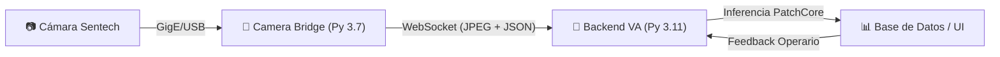

# Manual Técnico: Arquitectura Nuvant V2 (Modular) 🏗️

Este documento describe la arquitectura interna, el stack tecnológico y las decisiones de diseño del sistema **Nuvant Vision System**.

## 1. Stack Tecnológico

El sistema está diseñado bajo una arquitectura de **microservicios dockerizados**, separando la adquisición física de la inteligencia computacional.

| Capa | Tecnología | Razón |
|---|---|---|
| **Acquisición (Bridge)** | Python 3.7 | Compatibilidad mandatoria con `stapipy` (drivers Omron/Sentech). |
| **Cerebro (Backend)** | Python 3.11 + FastAPI | Alto rendimiento, manejo asíncrono y soporte para PyTorch moderno. |
| **IA / ML** | PatchCore (Anomalib) | Algoritmo de vanguardia para detección de anomalías sin necesidad de datos de fallo. |
| **Base de Datos** | SQLite + SQLAlchemy | Ligera, portable y embebida para despliegue en IoT. |
| **Frontend** | Vanilla JS + WebSockets | Cero latencia en renderizado de frames y gráficas en tiempo real. |

---

## 2. Diagrama de Flujo (ETL Real-Time)

1.  **Extract**: El Bridge extrae frames crudos de la cámara usando el protocolo GenICam.
2.  **Transform**: Codifica el frame a JPEG (ajustando calidad/FPS) y añade metadatos (Línea/Punto).
3.  **Load**: Los envía vía WebSocket al backend para ser cargados en el buffer de entrenamiento o el detector de anomalías.

---

## 3. Modelo de Datos Modular

Para soportar el crecimiento a múltiples cámaras en una misma planta, se implementó una jerarquía de 3 niveles:

- **ProductionLine**: Representa un proceso físico (Ej: "Línea de Hilandería").
- **InspectionPoint**: Representa una posición de cámara única vinculada a una línea.
- **Reference**: Representa el modelo AI (la "huella digital" de la tela) entrenado para ese punto específico.

> [!IMPORTANT]
> Esta estructura permite que una misma tela (Referencia) tenga comportamientos distintos según la cámara que la mire, aislando los ruidos visuales de cada punto de inspección.

---

## 4. Mejores Prácticas de Ingeniería

1.  **Aislamiento de Entorno**: El uso de Docker garantiza que los drivers de la cámara (muy estrictos con la versión de Python) no interfieran con las librerías de IA.
2.  **Auto-Migración**: El sistema detecta cambios en el esquema de base de datos al arrancar y aplica los parches necesarios (como la adición de `point_id` a referencias legacy).
3.  **Resiliencia**: El Bridge implementa **backoff exponencial** para reconexión automática; si el backend cae, la cámara sigue intentando conectar sin detener el proceso de planta.
4.  **Healthcheck**: Docker monitorea la salud del backend mediante validaciones internas de `urllib`, reiniciando servicios solo si es estrictamente necesario.

## 5. Filosofía de Almacenamiento: "Zero-Storage" 📉

El sistema está optimizado para dispositivos IoT con recursos de almacenamiento limitados (SD, eMMC, SSDs pequeños).

1.  **Procesamiento en RAM**: Los frames capturados durante el entrenamiento se almacenan en un buffer de memoria volátil. Nunca tocan el disco en su estado crudo.
2.  **Extracción y Descarte**: Una vez generado el modelo (`model.pkl`), las imágenes originales se eliminan de la RAM. El modelo resultante es ~1000 veces más pequeño que las fotos originales.
3.  **Inferencia en Tiempo Real**: En modo producción, cada frame se procesa, se califica y se descarta inmediatamente. No existe un proceso de "grabación" de video, lo que evita el desgaste de las celdas de memoria del hardware.
4.  **Escalabilidad a Futuro**: La arquitectura permite habilitar un "Logging de Defectos" que guarde capturas específicas si el cliente lo requiere, pero por defecto opera bajo impacto cero en disco.

---

## 6. Escenario de Falla: Modo Live sin Cámara

Si ejecutas `CAMERA_MODE=live` pero la cámara no está conectada fisicamente:
- El contenedor `bridge-linea1-final` entrará en estado **Exited (1)**.
- El log mostrará: `[Bridge] ERROR conectando cámara: Cámara no encontrada`.
- **Solución**: Conecta la cámara y ejecuta `docker compose restart bridge-linea1-final`. El sistema no necesita ser reinstalado.
