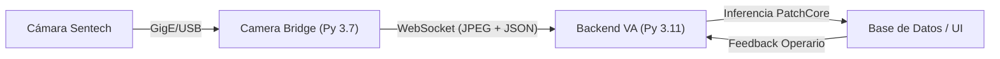

# Manual Técnico: Arquitectura Nuvant V2 (Modular)

Este documento describe la arquitectura interna, el stack tecnológico y las decisiones de diseño del sistema **Nuvant Vision System**.

> [!NOTE]
> Para una explicación teórica profunda, algoritmos detallados y justificación del comportamiento paramétrico de los contenedores a nivel avanzado , consulta el documento: [Arquitectura Profunda y Teoría](file:///home/juan-david-valencia/Escritorio/Nuvant_ETL_VA_Fusion/ARQUITECTURA_Y_TEORIA_PHD.md).

## 1. Stack Tecnológico

El sistema está diseñado bajo una arquitectura de **microservicios dockerizados**, separando la adquisición física de la inteligencia computacional.

| Capa | Tecnología | Razón |
|---|---|---|
| **Acquisición (Bridge)** | Python 3.7 | Compatibilidad mandatoria con `stapipy` (drivers Omron/Sentech). |
| **Cerebro (Backend)** | Python 3.11 + FastAPI | Alto rendimiento, manejo asíncrono y soporte para PyTorch moderno. |
| **IA / ML** | PatchCore (Anomalib) | Algoritmo de vanguardia para detección de anomalías sin necesidad de datos de fallo. |
| **Base de Datos** | SQLite + SQLAlchemy | Ligera, portable y embebida para despliegue en IoT. |
| **Frontend** | Vanilla JS + WebSockets | Cero latencia en renderizado de frames y gráficas en tiempo real. |

---

## 2. Diagrama de Flujo (ETL Real-Time)

1.  **Extract**: El Bridge extrae frames crudos de la cámara usando el protocolo GenICam.
2.  **Transform**: Codifica el frame a JPEG (ajustando calidad/FPS) y añade metadatos (Línea/Punto).
3.  **Load**: Los envía vía WebSocket al backend para ser cargados en el buffer de entrenamiento o el detector de anomalías.

---

## 3. Modelo de Datos Modular

Para soportar el crecimiento a múltiples cámaras en una misma planta, se implementó una jerarquía de 3 niveles:

- **ProductionLine**: Representa un proceso físico (Ej: "Línea de Hilandería").
- **InspectionPoint**: Representa una posición de cámara única vinculada a una línea.
- **Reference**: Representa el modelo AI (la "huella digital" de la tela) entrenado para ese punto específico.

> [!IMPORTANT]
> Esta estructura permite que una misma tela (Referencia) tenga comportamientos distintos según la cámara que la mire, aislando los ruidos visuales de cada punto de inspección.

---

## 4. Mejores Prácticas de Ingeniería

1.  **Aislamiento de Entorno**: El uso de Docker garantiza que los drivers de la cámara (muy estrictos con la versión de Python) no interfieran con las librerías de IA.
2.  **Auto-Migración**: El sistema detecta cambios en el esquema de base de datos al arrancar y aplica los parches necesarios (como la adición de `point_id` a referencias legacy).
3.  **Resiliencia**: El Bridge implementa **backoff exponencial** para reconexión automática; si el backend cae, la cámara sigue intentando conectar sin detener el proceso de planta.
4.  **Healthcheck**: Docker monitorea la salud del backend mediante validaciones internas de `urllib`, reiniciando servicios solo si es estrictamente necesario.

## 5. Gestión de Persistencia y "Zero-Storage"

El sistema está optimizado para garantizar la integridad de los datos sin saturar el almacenamiento, utilizando una jerarquía consolidada en `Nuvant_VA/backend/`:

1.  **Estructura Consolidada**: 
    - `db/`: Almacena `nuvant.db` (SQLite). Centralizado para evitar redundancias.
    - `local_storage/`: Almacena los modelos PatchCore comprimidos.
    - `logs/`: Registros de auditoría y errores del motor de IA.
2.  **Bind Mounts Agnosticismo**: Se eliminaron los volúmenes nominales de Docker en favor de montajes directos. Esto permite:
    - Backup manual sencillo copiando las carpetas del host.
    - Auditoría de logs en tiempo real sin herramientas de Docker.
    - Persistencia garantizada incluso tras eliminar los contenedores.
3.  **Procesamiento en RAM**: Los frames crudos de entrenamiento se mantienen en memoria volátil y se descartan tras generar el modelo, respetando la filosofía de bajo impacto en disco.

---

## 6. Despliegue en Hardware IoT (NVIDIA Jetson / ARM64) 

Para garantizar el rendimiento en arquitectura ARM, considera estos puntos críticos:

### A. Drivers Sentech (stapipy) en ARM
El Dockerfile del Bridge está preparado para detectar la arquitectura. Sin embargo, debido a restricciones de licencia, **debes colocar el archivo `.whl` de ARM64** en la carpeta `camera_bridge/wheels/` antes de construir. El sistema te avisará con un `WARNING` si falta, pero el modo real fallará sin él.

### B. PyTorch en ARM/Jetson
En el backend, el `requirements.txt` usa versiones CPU por defecto. En una Jetson:
1.  **NO** uses la versión `+cpu` de PyTorch si quieres aceleración por GPU.
2.  Instala el `torch` y `torchvision` proporcionado por NVIDIA (archivos `.whl` específicos para JetPack).
3.  El Dockerfile del Backend (`Nuvant_VA/docker/Dockerfile`) es compatible con bases `l4t-pytorch` si se requiere máxima optimización.

### C. Visualización Industrial
El Heatmap (V32.5) ha sido optimizado con **mezcla normal de opacidad al 60%** (eliminando modos 'screen' conflictivos) para ser visible incluso bajo luces intensas de planta, y su color métrico está sincronizado matemáticamente con el umbral dinámico estricto para no perderse en telas azules, oscuras o de patrones geométricos complejos.

---

## 7. Escenario de Falla: Modo Live sin Cámara

Si ejecutas `CAMERA_MODE=live` pero la cámara no está conectada fisicamente:
- El contenedor `bridge-linea1-final` entrará en estado **Exited (1)**.
- El log mostrará: `[Bridge] ERROR conectando cámara: Cámara no encontrada`.
- **Solución**: Conecta la cámara y ejecuta `docker compose restart bridge-linea1-final`. El sistema no necesita ser reinstalado.
