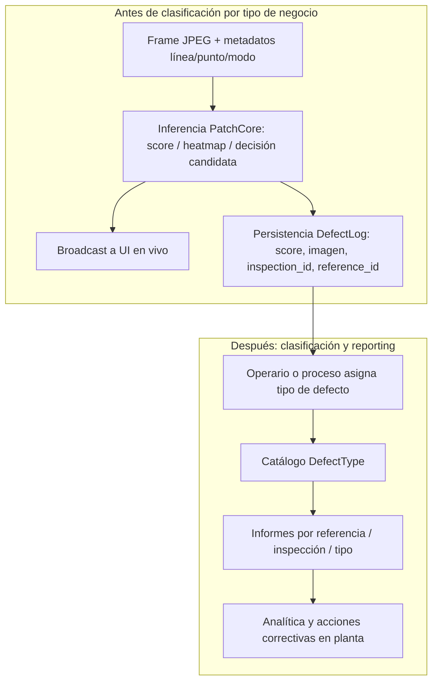

# Informe ejecutivo — Nuvant VA (visión artificial industrial)

**Audiencia:** Dirección, gerencia técnica y de planta  
**Versión:** Informe unificado (prototipo industrial → argumento de solución de producción)  
**Evidencia operativa:** Referencia **id 33**, inspecciones **123 a 126** (base de datos del despliegue; fecha de actividad analizada: **2026-03-27**).  
**Motor:** PatchCore **V32** (implementación alineada al trabajo de Roth et al., CVPR 2022).

---

## Marco conceptual: qué es un **prototipo**, por qué se usa aquí, y cuál es el **objetivo final**

### Qué es un prototipo (en ingeniería de producto industrial)

Un **prototipo** es una **implementación real y funcional** del sistema (software, integración con cámara, base de datos, flujo de inspección), pero **aún no equivalente** a un **producto de producción pleno**. La distinción no es “que funcione o no”: el prototipo **sí funciona**; lo que falta para hablar de producto cerrado suele ser una combinación de: **sensado endurecido** (iluminación, óptica, repetibilidad mecánica), **procedimientos operativos** (quién entrena, cuándo se recalibra, cierre formal de sesiones), **métricas de negocio medidas** (coste de falso positivo, throughput aceptable), **soporte y continuidad** (versiones, respaldos, escalado multi-línea), y a veces **homologación** interna o con cliente.

En otras palabras: el prototipo **demuestra viabilidad técnica y valor** con riesgo acotado; el producto **compromete** desempeño y operación en el tiempo.

### Por qué se usa un prototipo en este contexto

Se adopta un prototipo porque el problema **no se resuelve en laboratorio genérico**: depende de **la línea**, **las referencias**, **la iluminación disponible** y **el criterio de calidad** de la empresa. Construir directamente “producto final” sin pasar por un despliegue real implicaría **invertir en hardware y proceso** sin evidencia de que el flujo **captura → entrena → inspecciona → persiste** funciona en **esa** planta.

El prototipo permite:

- **Validar la arquitectura** (bridge, backend, UI, BD) con tráfico real.  
- **Ajustar calibración** (contaminación, sensibilidad) con operarios reales.  
- **Detectar pronto** limitaciones de **cámara e iluminación** antes de congelar especificaciones.  
- **Generar datos** (inspecciones, defectos) que alimenten el argumento de negocio y la futura **analítica**.

**Por qué es importante dejarlo explícito en este informe:** sin esta aclaración, dirección podría interpretar las cifras y capturas como **certificación de rendimiento** o como **producto listo para escalar sin más inversión en sensado**. Eso sería **incorrecto** y dañaría la confianza. El mensaje honesto es: **lo logrado demuestra capacidad del diseño**; el **siguiente paso** es **industrializar** el entorno físico y el proceso alrededor del software.

### Objetivo final que se busca con esta solución

El objetivo **no** es permanecer en prototipo. El objetivo final es disponer de una **solución de inspección en producción** que:

1. **Inspeccione en continuo** (o al ritmo de línea acordado) con **modelo por referencia**, alineado al tipo de producción textil de la empresa.  
2. **Reduzca el riesgo** de enviar material defectuoso no detectado y **optimice el coste** de revisión (falsos positivos) mediante **calibración** y buen sensado.  
3. **Deje trazabilidad estructurada** (referencia, inspección, eventos, tipificación cuando aplique) para **calidad, reclamos y mejora continua**.  
4. **Habilite analítica** sobre históricos (defectos recurrentes por referencia, tendencias) para **decisiones informadas** en planta (proceso, proveedores, mantenimiento).  
5. Evolucione desde el estado actual (**prototipo industrial con sensado mejorable**) hasta un **despliegue endurecido** reconocido por la organización como **activo operativo**, no como prueba puntual.

Todo el trabajo realizado (integración, motor PatchCore, evidencias en BD) está **al servicio** de ese objetivo final; el prototipo es el **medio**, no el **fin**.

---

## Parte A — Limitaciones propias del **prototipo actual** en este contexto

Las limitaciones siguientes describen **qué no representa todavía** el despliegue frente al objetivo final de solución de producción:

| Limitante | Efecto en la práctica | Implicación para interpretación |
|-----------|------------------------|----------------------------------|
| **Cámara y óptica** | Encuadre, distancia de trabajo, profundidad de campo y vibración pueden variar entre sesiones. | Dispersión en apariencia y en métricas entre tomas; los informes visuales pueden mostrar **defectos o heatmaps “suaves”** si la captura es movida o fuera de foco (véase también nota técnica al final de esta parte). |
| **Iluminación** | Luz insuficiente o muy direccional → exposición larga o sombras → **pérdida de textura de alta frecuencia**, que es justamente lo que explotan los descriptores profundos. | Mayor variabilidad score entre turnos; solución prioritaria: **ingeniería de sensado**, no solo software. |
| **Condición “train = test”** | El modelo aprende “normalidad” bajo las condiciones del momento; si inspección ocurre con **otra** luz/velocidad, hay **desalineación estadística**. | Reentrenamiento o recalibración por campaña puede ser necesario; es **normal** en despliegue industrial, no un fallo conceptual. |
| **Taxonomía de defectos** | En las evidencias citadas, los registros pueden aparecer como tipo genérico (p. ej. “Otro”) mientras madura el uso. | La **detección** puede estar operativa antes que la **clasificación fina** por tipo; son capas distintas. |
| **Métricas de negocio globales** | PPM, ROI, coste por falso positivo **no** están cerrados en este documento sin campaña de medición acordada con planta. | Este texto fundamenta **viabilidad técnica y científica** y evidencia de **pipeline**; los KPI económicos requieren **estudio de campo** dedicado. |

**Nota sobre imágenes “desenfocadas” en informes:** además del desenfoque **óptico o por movimiento** (que **degrada** la señal útil para el modelo), el **mapa de anomalía** se construye como campo de puntuación sobre una **rejilla de parches** y suele mostrarse **interpolado y suavizado** (coherente con la literatura). Por tanto, un defecto puede verse “borroso” en el informe **aunque** la decisión sea correcta: no siempre es fallo de enfoque de la cámara, sino **resolución espacial del mapa** respecto a la imagen completa.

---

## Parte B — Fundamento **científico**: metodología, flujo y benchmarks públicos

### B.1 Referencia bibliográfica principal

- **Roth, K., Pemula, L., Zepeda, J., Schölkopf, B., Brox, T., Gehler, P.** *Towards Total Recall in Industrial Anomaly Detection.* **IEEE/CVF Conference on Computer Vision and Pattern Recognition (CVPR), 2022.**  
  - **PDF oficial (CVF Open Access):** [http://openaccess.thecvf.com/content/CVPR2022/html/Roth_Towards_Total_Recall_in_Industrial_Anomaly_Detection_CVPR_2022_paper.html](http://openaccess.thecvf.com/content/CVPR2022/html/Roth_Towards_Total_Recall_in_Industrial_Anomaly_Detection_CVPR_2022_paper.html)  
  - **Preprint (arXiv):** [https://arxiv.org/abs/2106.08265](https://arxiv.org/abs/2106.08265)  

En ese trabajo se introduce **PatchCore**: uso de características de **red neuronal preentrenada** (p. ej. WideResNet), **banco de memoria** de parches normales (con **muestreo tipo coreset** para eficiencia), y puntuación de anomalía por **vecindad en el espacio de embeddings** con localización en imagen. El entrenamiento usa **solo imágenes sin defecto** (escenario **no supervisado** respecto a anomalías), típico de industria donde los defectos son raros o no exhaustivamente etiquetados.

### B.2 Metodología (resumen operativo alineado al paper)

1. **Extracción de características:** capas intermedias del backbone (p. ej. `layer2` y `layer3`), alineación espacial, agregación local y **normalización L2** por parche → espacio donde **similitud coseno** equivale a proximidad geométrica en la esfera unitaria.  
2. **Memoria:** conjunto representativo de parches “normales” (coreset / submuestreo greedy).  
3. **Inferencia:** para cada parche de test, distancia a vecinos en memoria; agregación a **nivel imagen** (p. ej. máximo sobre parches) y mapa de calor para **localización**.  
4. **Calibración (ingeniería Nuvant V32.5):** umbral derivado de la distribución de **máximos por imagen de entrenamiento** (coherente con la decisión por máximo en test), más **margen** configurable para producción — documentado en el código y en `COMPARATIVA_PATCHCORE_PAPER.md` del repositorio.

### B.3 ¿Qué “benchmark” se usa en la literatura y qué resultados se publican?

El estándar de facto en la comunidad es **MVTec AD** (conjunto de objetos y texturas industriales con tren/test anómalo). En comunicaciones asociadas al artículo y en el ecosistema *papers with code*, se reportan órdenes de magnitud del estilo:

- **Detección a nivel imagen:** AUROC imagen del orden de **~99.6%** en el escenario reportado para PatchCore en ese benchmark.  
- **Localización a nivel pixel:** AUROC de segmentación en torno a **~98.4%** en las mismas fuentes secundarias habituales (resúmenes del paper y tablas de resultados).

**Advertencia metodológica:** esas cifras son en **MVTec AD** con protocolo académico fijo. **No** se pueden extrapolar automáticamente al tejido y la línea de la empresa sin un **estudio de validación propio** (curvas operativas, coste de falso positivo en su proceso, etc.). Sirven para situar el método en el **estado del arte** publicado, no como garantía numérica en planta.

**Dónde contrastar públicamente:** además del PDF de CVPR y arXiv, existen agregadores como **Papers With Code** (búsqueda: *Towards Total Recall in Industrial Anomaly Detection*) que posicionan el método frente a otros en tablas de **leaderboard** sobre MVTec AD.

### B.4 A quién “supera” en el marco académico (lectura correcta)

En el tiempo de publicación (2022), PatchCore se comparó en el paper contra **métodos previos de detección de anomalías industriales** en el mismo benchmark (enfoques basados en autoencoders, GANs, métodos de un solo clase, etc.). La reducción de error relativa que citan los autores frente a competidores depende de la **tabla concreta** del artículo (véase Sección experimental en el PDF). **No** implica superioridad automática frente a *cualquier* sistema artesanal en un solo taller: implica **posición competitiva demostrada en un protocolo reproducible** (MVTec AD), que es el lenguaje de la comunidad científica.

---

## Parte C — Estrategia frente al **tipo de producción** y frente a la **visión artificial clásica**

### C.1 Qué caracteriza a este tipo de industria (textil / enrollado / alta mix de referencias)

- **Muchas referencias (SKU):** cambio frecuente de artículo, color, trama, acabado.  
- **Variación legítima dentro del “bueno”:** mismo artículo, distintos lotes, tensión, brillo.  
- **Defectos heterogéneos y no siempre predefinidos:** desde manchas hasta irregularidades de trama; no es razonable exigir **catálogo cerrado** el día uno.  
- **Necesidad de trazabilidad:** vincular eventos a turno, referencia, inspección, para calidad y reclamos.

### C.2 Límites de la visión artificial “clásica” aquí

Por **VA clásica** se entiende, de forma resumida: umbrales en intensidad/color, diferencias de fondo, morfología básica, plantillas rígidas, o reglas por ROI fijas **sin** modelo de apariencia aprendido por referencia.

| Problema | Por qué escala mal en este contexto |
|----------|-------------------------------------|
| **Reglas por referencia** | Cada nuevo artículo exige reingeniería manual de umbrales y máscaras. |
| **Sensibilidad a iluminación** | Cambia histogramas globales; las reglas fijas **derivan** entre turnos. |
| **Defectos no modelados** | Si no está en la regla, no se ve; el coste de cubrir “todo” explota. |
| **Textura fina** | Los defectos son a menudo **subtle**; los descriptores manuales (gradientes simples, etc.) pierden frente a representaciones profundas entrenadas en millones de imágenes naturales. |

Esto está alineado con la literatura de **inspección industrial anómala**: el consenso es pasar de hand-crafted a **features profundos** + **memoria de normalidad** para datasets con pocos defectos etiquetados.

### C.3 Por qué PatchCore + “una referencia, un modelo” encaja mejor

- **Entrenamiento solo con bueno:** encaja con la realidad (defectos raros o no etiquetados masivamente).  
- **Generalización a anomalías no vistas:** el objetivo es **desviación respecto a la normalidad aprendida**, no coincidencia con una lista finita de patrones.  
- **Escalado:** el coste marginal por nueva referencia es **entrenar un modelo acotado** (y calibrar), no rehacer cientos de reglas a mano.

---

## Parte D — Evidencia del prototipo: referencia **33**, inspecciones **123–126**

Lo siguiente se sustenta en datos persistidos en el despliegue (tablas `references`, `inspections`, `defect_logs`).

### D.1 Referencia 33 — qué demuestra

- **Nombre:** `1604035_corsso_burdeos_270326`  
- **Modelo:** `V32_PatchCore`, entrenamiento **`trained_from: camera`**, **200** frames capturados, **100** imágenes efectivas en entrenamiento, `contamination` **0.03**, sensibilidad almacenada **-100** (ajuste conservador en inferencia), marca temporal de entrenamiento **2026-03-27T15:24:08**.  
- **Qué prueba:** que el **ciclo planta** “capturar desde línea → entrenar → desplegar modelo” está **cerrado** y **auditables** los hiperparámetros en BD.

### D.2 Inspecciones 123 a 126 — qué prueba cada una

| Inspección | Ventana | Defectos persistidos | Lectura |
|------------|---------|----------------------|---------|
| **123** | ~27 s | **6** | Sesión corta con varios eventos registrados (prueba intensiva o material desafiante). |
| **124** | ~24 s | **5** | Comportamiento repetible de detección + persistencia en la misma referencia. |
| **125** | Inicio sin `stopped_at` | **0** | Sesión **no cerrada** en BD: **deuda de procedimiento** (operación/UI), no prueba de ausencia de valor del motor. |
| **126** | ~31 s | **6** | Misma cantidad de eventos que otras sesiones pero **scores numéricos más bajos** en BD que en 123/124 → coherente con **variación de captura** (luz, plano, velocidad) entre tomas. |

**Total en sesiones cerradas (123, 124, 126):** **17** defectos con trazas en base, todos asociados a referencia **33** y tipo **“Otro”** en el catálogo en esas muestras — coherente con prototipo donde primero se valida **detección + trazabilidad**; la **refinación taxonómica** es madurez posterior.

**Mensaje de ventas con rigor:** no se afirma “tasa de acierto del X%” sin estudio; sí se afirma **hecho demostrable:** **pipeline productivo** con **datos en BD** y **modelo entrenado en condiciones reales**.

---

## Parte E — Por qué esta solución es **competitiva**, por qué es **alta ingeniería** y por qué **no es lo mismo** que un script de umbrales

1. **Anclaje en estado del arte publicado** (CVPR 2022, arXiv:2106.08265) + implementación **V32.5** con calibración **explicable** (máximo por imagen + margen).  
2. **Arquitectura de producto:** bridge GigE, backend en contenedor, WebSocket para tiempo real, BD relacional **Línea → Punto → Referencia → Inspección → Defecto → Tipo**, opción PLC.  
3. **Palancas de operación:** **contaminación** (`contRange`, entrenamiento: percentil de máximos por imagen antes del margen) y **sensibilidad** (`sensOffset`, inferencia: desplazamiento de umbral **sin** reentrenar por cada cambio leve de turno). La **varianza PCA** en UI atiende compatibilidad con pipeline legado V31; en **V32** el foco de negocio es contaminación + sensibilidad + margen + calidad de captura.  
4. **Ingeniería de estabilidad:** debounce de alarmas, control de latencia por descarte de frames viejos en inspección — relevante en **velocidad** de línea.

### Arquitectura y flujo de datos (antes / después de clasificar por tipo)

---

## Parte F — Impacto esperado en **producción** y en **analítica** (marco realista)

### F.1 Producción: velocidad, ahorro, calidad

| Palanca | Mecanismo | Condición |
|---------|-----------|-----------|
| **Velocidad / throughput** | Inspección automática en continuo reduce **cuellos** de revisión manual total si el umbral está bien calibrado. | Requiere sensado estable; sin ello, aumenta **revisión** por falsos positivos. |
| **Ahorro** | Menos material defectuoso no detectado **si** la curva operativa FP/FN es favorable en su línea. | Debe cuantificarse con **estudio** (coste de parada vs coste de reclamo). |
| **Menos defectos “pasados”** | Modelo de normalidad + sensibilidad ajustable vs inspección solo humana en fatiga. | Complementario a **muestreo** y política de segunda revisión. |

*Ninguna de estas magnitudes se presenta aquí como número cerrado sin medición; la tesis es que el **diseño** permite **optimizar** esas variables cuando el sensado converge a producción.*

### F.2 Analítica para decisiones informadas

La misma BD que hoy almacena **referencia, inspección, score, imagen y tipo** habilita, con volumen:

- **Tendencias** por referencia (picos de eventos, correlación con turno).  
- **Priorización** de causas (cuando la taxonomía madure: tipo de defecto × línea).  
- **Retroalimentación a proceso** (tintorería, proveedor de hilo, tensión de enrollado) con **series temporales**, no solo juicio anecdótico.

---

## Parte G — Cierre: propuesta de valor para la organización

1. **Prototipo con límites explícitos (Parte A)** — transparencia frente a dirección.  
2. **Método con respaldo científico y benchmarks públicos (Parte B)** — no es una “caja negra” sin literatura.  
3. **Encaje industrial y superioridad **relativa** frente a VA clásica en escenarios multi-referencia (Parte C).  
4. **Evidencia en datos reales (Parte D)** — referencia 33 e inspecciones 123–126.  
5. **Ingeniería de sistema y camino a impacto medible (Partes E–F).**

**Llamada a la acción:** financiar el salto de **prototipo endurecido** (sensado + procedimiento + validación de KPI) a **solución de planta** replicable, usando la misma arquitectura ya implementada.

---

## Anexo — Tabla resumen numérica (inspecciones 123–126, ref. 33)

| Inspección | Inicio (UTC) | Fin (UTC) | Defectos | Rango orientativo `anomaly_score` (BD) |
|------------|----------------|-----------|----------|----------------------------------------|
| 123 | 2026-03-27 15:32:30 | 2026-03-27 15:32:57 | 6 | ~19.5 – ~27.0 |
| 124 | 2026-03-27 15:36:16 | 2026-03-27 15:36:40 | 5 | ~13.8 – ~30.3 |
| 125 | 2026-03-27 15:41:45 | *(no cerrada)* | 0 | — |
| 126 | 2026-03-27 15:41:45 | 2026-03-27 15:42:15 | 6 | ~4.7 – ~11.3 |

**Parámetros ref. 33 (extracto):** `trained_from: camera`, `captured_frames: 200`, `train_sample_size: 100`, `contamination: 0.03`, `sensitivity: -100`, `version: V32_PatchCore`.

---

## Anexo — Fuente de datos

Consulta a SQLite del backend (`references`, `inspections`, `defect_logs`, `defect_types`) en el entorno de despliegue. Los `anomaly_score` son los del pipeline interno.

---

## Referencias citadas

1. Roth, K. et al., *Towards Total Recall in Industrial Anomaly Detection*, CVPR 2022. [CVF Open Access](http://openaccess.thecvf.com/content/CVPR2022/html/Roth_Towards_Total_Recall_in_Industrial_Anomaly_Detection_CVPR_2022_paper.html) · [arXiv:2106.08265](https://arxiv.org/abs/2106.08265)  
2. Documentación interna de alineación implementación–paper: `COMPARATIVA_PATCHCORE_PAPER.md` (repositorio Nuvant).

---

*Documento preparado para presentación a dirección. Las métricas MVTec AD citadas corresponden a la literatura y comunicaciones del método; la validación en planta propia requiere protocolo acordado con la empresa.*
